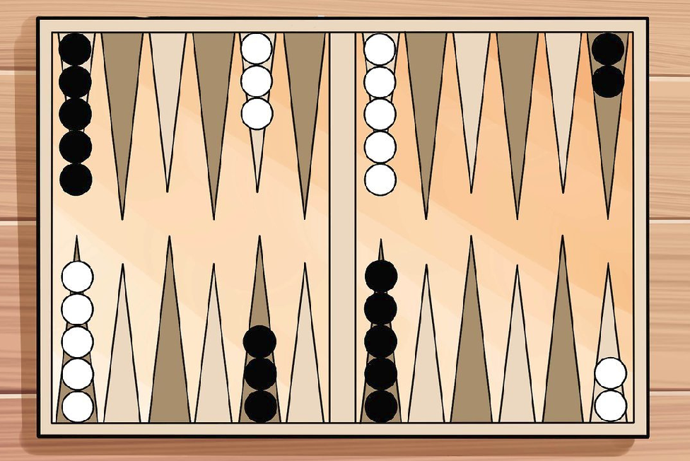
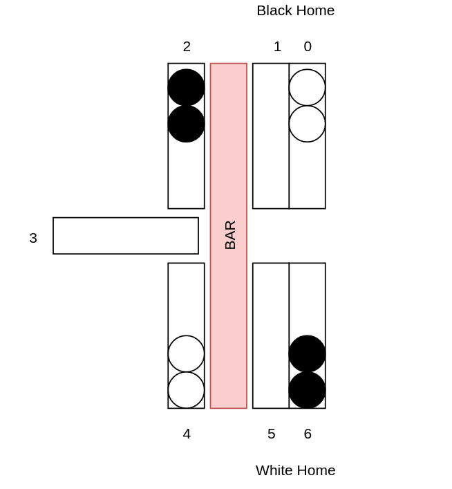

# OpenAI Backgammon Gym

This is a backgammon gym wrapped in the OpenAI Framework.



## Table of Contents

---
...

---

### Backgammon Gym


Backgammon is a game for two players, played on a board that originally has 24 narrow triangles, and each move is determined by the roll of two dice. In depth rules can be found [here](https://www.bkgm.com/rules.html).

---

### Installation

First clone the GitHub Repository to the folder of choice:

```bash
git clone https://github.com/Sjyhne/reduced_backgammon_gym
```

Then enter the cloned folder:

```bash
cd reduced_backgammon_gym
```

Finally install the gym environment using pip

```bash
pip install -e .
```

---

### Environment

Below are the customizable parameters for the creation of the board with a cohering explanation:

**n_spots**: The total number of narrow triangles on the board

**n_home_positions**: The total number of home positions each players gets

**n_pieces**: The number of pieces each player has on the board

**dice_sides**: Number of sides on the dice used

**max_n_stack**: The max number of pieces that can be stacked ontop of each other on the board

**double_chance**: The chance of acquiring two die of the same value (Only applies when the dice_sides are set to 2)

The encoding used to represent the states of the board is described below:

#### Observation Representation

| Index | Name | Representation | Min | Max |
| --- | --- | --- | --- | --- |
| 0 | Narrow Triangle 0 | 0: 0 pieces on the spot, `[1, ..., max_n_stack]`: 1 -> max_n_stack of WHITE pieces, `[max_n_stack + 1, ..., 2 * max_n_stack + 1]`: 1 -> max_n_stack of BLACK pieces. | 0 | `2 * max_n_stack + 1` |
| 1 | Narrow Triangle 1 | ... | ... | ... |
| ... | ... | ... | ... | ... |
| n_spots | Narrow Triangle n_spots | ... | ... | ... | ... |
| n_spots + 1 | White bar | 0: 0 pieces on the WHITE bar, 1: 1 or more pieces on the WHITE bar | 0 | 1 |
| n_spots + 2 | Black bar | 0: 0 pieces on the BLACK bar, 1: 1 or more pieces on the BLACK bar | 0 | 1 |
| n_spots + 3 | Dice Combinations |  `itertools.combinations_with_replacements(dice_sides, 2)` 0: (1, 1), 1: (1, 2), 2: ... | 0 | `len(itertools.combinations_with_replacements(dice_sides, 2)) - 1` |
| n_spots + 4 | Player turn | 0: WHITE player turn, 1: BLACK player turn | 0 | 1 |

#### Action Representation

| Index | Name | Representation | Min | Max |
| --- | --- | --- | --- | --- |
| 0 | Source index | `range(0, n_spots + 1)`, where each number refers to the index of the narrow triangles on the board, but the last number refers to BAR location | 0 | n_spots |
| 1 | Destination index | `range(0, n_spots + 1)`, where each number refers to the index of the narrow triangled on the board, but the last number refers to the OFF location | 0 | n_spots |

---

#### Reward

The player is given a reward of 1 if it wins, and a reward of 0 if it loses.

#### Starting State

The initial size and state of the board is given below:

```python
n_spots=7, 
n_home_positions=2, 
n_pieces=4, dice_sides=2, 
max_n_stack=4, 
double_chance=0.3
```

The starting state is defined as such:

```python
def initiate_board(self):
    board = [{"spot": k, "count": 0, "color": None} for k, i in enumerate(range(self.n_spots))]
    board[0].update({"count": 2, "color": self.white})
    board[2].update({"count": 2, "color": self.black})
    board[4].update({"count": 2, "color": self.white})
    board[6].update({"count": 2, "color": self.black})

    # A counter for how many has been moved to the bar
    bar = {self.white: 0, self.black: 0}
    # Only a counter for how many has been beared off
    off = {self.white: 0, self.black: 0}

    return board, bar, off
```

Which is better visualized in this way:




#### Episode Termination

One out of two things will happen:

1. One of the two players wins the game
2. The episode length is greater than the max episodes

#### Reset

The reset method returns the observation of the current state which includes:

* Where and how many pieces are on the board (Including the bar)
* What the dice roll is
* Which players turn it is

#### Render

The render method prints out a representation of the current state of the board
